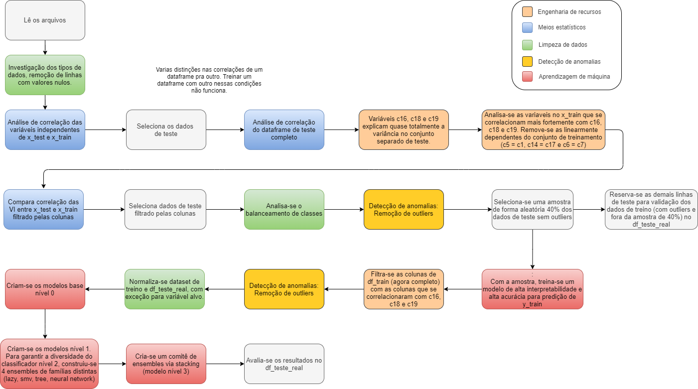

# Aplicação

O presente repositório tem como objetivo divulgar a solução do problema proposto no teste seletivo de pesquisador 2 de Machine Learning pelo Instituto Senai de Inovação em Sistemas Embarcados.

A base toda do projeto foi construída em cima da linguagem Python. Entretanto pode rodar independente do ambiente via docker.

## Enunciado do Desafio

Treinar um classificador binário incorporando o conceito de stacking em sua solução, e que esteja apto a justificar as escolhas que foram feitas ao longo do desenvolvimento.
Entre os diversos desafios, destaca-se as estratégias para rotulação do conjunto  de treinamento, que não é rotulado.


## Pipeline da Solução

A seguir temos um pipeline geral da solução para esse desafio.


## Organização do Código

```
aplicacao-flask
├── algorithms 
│   └── challenge_senai
│       ├── predictor_test.py
│       ├── predictor_train.py
│       └── main.py
│       
├── dataset
│   ├── created
│   │   ├── df_test_validation.parquet
│   │   ├── df_train.parquet
│   │   └── df_trainer_test.parquet
│   │   
│   └── original
│       ├── X_test.csv
│       ├── X_train.csv
│       └── y_test.csv
│       
├── docs
│   ├── build
│   │	├── ...
│   │	└── html 
│   ├── images
│   ├── source
│   └── results 
│
├── repository
│   └── repository_service.py  
│
│
├── trained
│   └── models
│       ├── models_to_evaluate
│       │   ├── level_0
│       │   ├── level_1
│      	│   └── level_2
│       │
│       └── models_to_train
│           
├── app.py
├── config.py
├── docker-compose.yml
├── Dockerfile
├── logger
├── README.md
└── requirements.txt
```

## Como executar o projeto

* **Com docker** -> Para gerar nova imagem: docker compose -f docker-compose.yml up --build
* **Sem docker** : 
1) Clone o repositório
2) Se não tem instalado o virtualenv, fazer o comando pip install virtualenv
3) Começe um ambiente virtual: virtualenv -p python3 venv
4) Instale as dependências: pip install -r requirements.txt
5) Va para a pasta src: cd algorithms/challenge_senai
6) Rode o arquivo: python main.py

Se desejar fazer tudo via chamada rest:
Rode o arquivo (na raiz) app: python app.py
A seguinte requisição (get) gera os datasets necessários para solução, além de treinar o modelo que vai prever y_train: localhost:5000/generate_datasets_parquet_and_model_to_predict_ytrain

Outra requisição importante (get) gera os modelos de machine learning necessários para a solução: localhost:5000/generate_models_to_validate_solution.

Maiores detalhes e outras opções de requisição estão na documentação da api (./docs/build/html/index.html):


## O projeto tem documentação?

A pasta docs/build/html/index.html possui toda documentação da API com explicação das funções nos códigos.


## Resultados

Alguns dos principais resultados produzidos podem ser encontradas [aqui](https://github.com/jesimar/desafio-senai/tree/main/docs)
