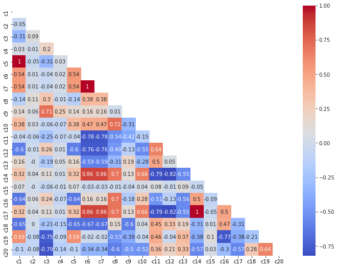
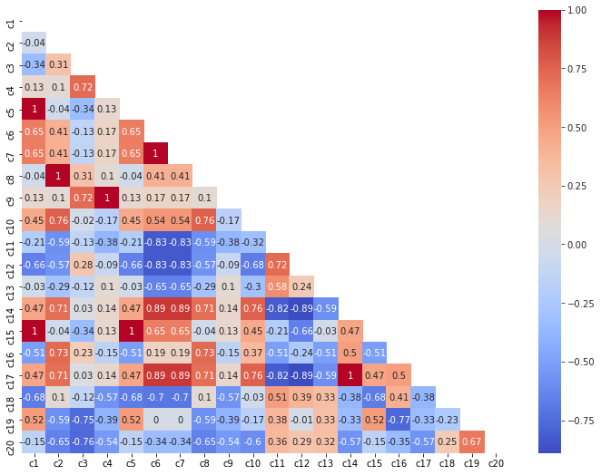
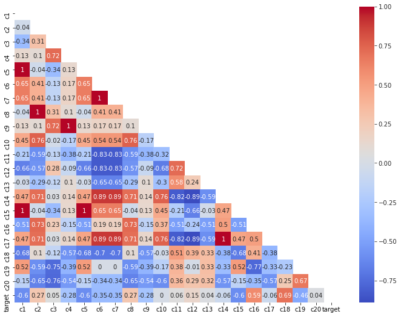
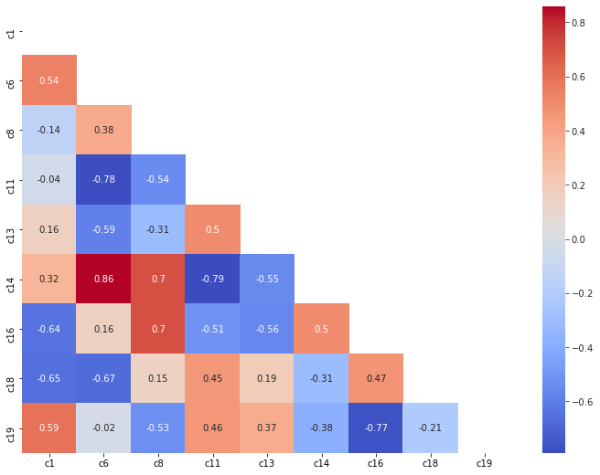
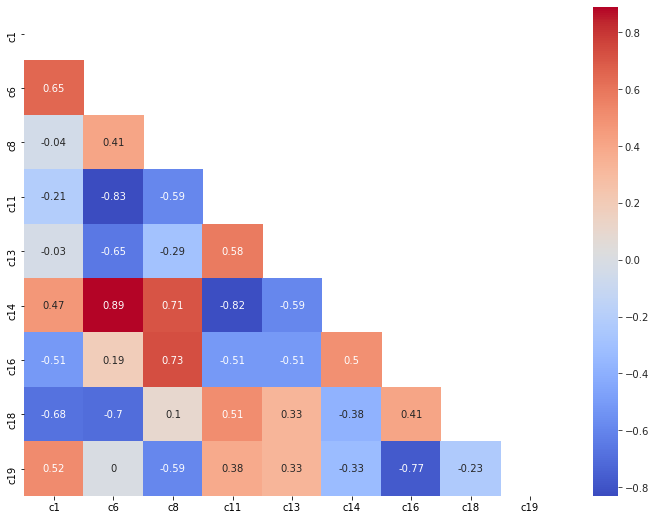
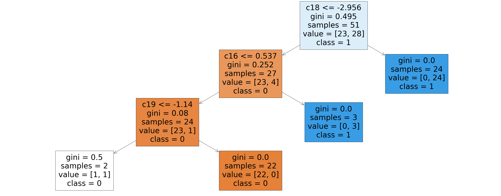
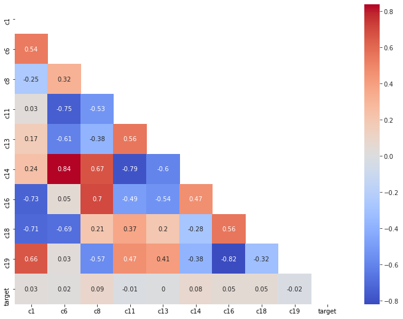
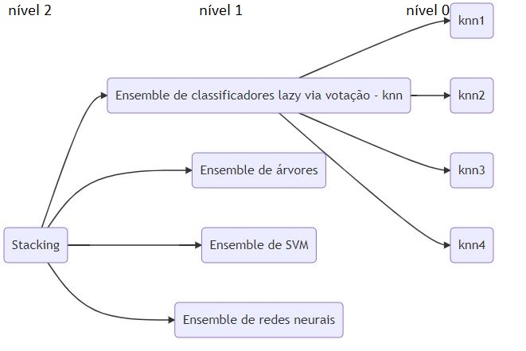

# Resultados Obtidos

A seguir são apresentados alguns resultados obtidos no decorrer do desafio.

## Desafios

* **Sem y_train**:
Dados vieram sem y_train, onde é necessário, buscar estratégias para repor o mesmo. Abordagem (apenas inicial) com clusters não funcionou. 
Optou-se então por separar um parte do conjunto de teste para gerar o y_train.

* **Dados de teste pequenos, overfitting e data leakage** -> 
A fim de se evitar o data leakage, separou-se um conjunto de teste para gerar o y_train, do conjunto para validação. 
Entretanto, cuidados com o percentual na separação e na seleção de linhas foram necessários.

* **Dados de teste com comportamento distinto dos dados de treinamento**: 
Várias variáveis apresentaram comportamento absolutamente distinto no treino e no teste.
Observe os próximos gráficos, eles mostram as correlações entre as variaveis independentes dos datasets de treino e de teste (nos arquivos originais, enviados):

Correlação nas variaveis independentes na base de treino:

Correlação nas variaveis independentes na base de teste:

Fica evidente a diferença entre correlações entre variáveis algumas independentes de x_train para x_test (por exemplo, c2 e c4). 
Prever o target de outro dataframe nessas condições pode não funcionar.

Para resolver, inicialmente viu-se como o target nos dados de treino se relacionam com as demais variáveis:

Aparentemente c16, c18 e c19 são variáveis que influenciam significativamente a variável target. 
Após testes concluindo como essas variáveis inpactam, deciciu-se focar apenas nessas variáveis e também nas que se correlacionam com elas, no caso, as colunas 'c1', 'c6', 'c8', 'c11', 'c13', 'c14','c16', 'c18', 'c19'.

Como ficou os gráficos de correlação agora?
Correlação nas variaveis independentes na base de treino com feature engineering:

Correlação nas variaveis independentes na base de teste com feature engineering:

Seguiu-se então para a previsão de y_train. 
Nesse caso optou-se por um classificador de facil interpretabilidade para mais fácil auditoria, mas com alta acuracidade. Criou-se então um modelo de ML baseado em árvore de decisão:

* **Y_train não tem boa correlação com as variáveis do x_train**:
Ter feito a análise da natureza da interação entre as variaveis ajudou, mas ainda tem-se o problema da baixa correlação de y_train com x_train:

Para conseguir passar por cima disso e garantir boa acurácia no conjunto de validação é necessário uma boa estratégia de machine learning.

* **Conseguir boa acurácia no conjunto de validação utilizando dados do treinamento**: 

Sabe-se que a diversidade é uma das coisas necessárias para garantir maior desempenho entre classificadores ensemble.
Uma maneira perfeita de garantir essa diversidade seria agrupar classificadores que aprenderam as coisas de maneiras distintas.
Pensando nisso, foi criado para essa solução um comitê de ensembles. Que no caso tem 3 níveis, conforme figura a seguir.

## Resultados

A seguir temos os resultados alcançados. Chegou-se a uma acurácia de 73% no comitê de ensemble em cima dos dados de teste, usando dados do treinamento.
* **Gráfico acurácia**:

* **Gráfico curvaroc**:
