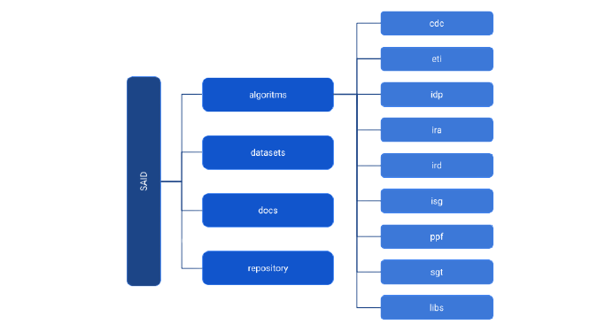

INTRODUÇÃO
==========

O Projeto SAID (Sistema de Análise Inteligente de Dados) busca realizar serviços
de análises de dados. O SAID foi implementado como uma aplicação flask em Python
e utiliza em sua comunicação API Rest via JSON.

O projeto SAID possui a seguinte estrutura geral de pastas:

Dentro da pasta `algorithms` temos os principais algoritmos desenvolvidos. Cada um
dos módulos desenvolvidos foram colocados em uma pasta distinta de forma a facilitar
a compreensão. Os módulos desenvolvidos são: CDC, ETI, IDP, IRA, IRD, ISG, PPF e SGT.

A pasta `datasets` contém alguns arquivos utilizados no treinamento e avaliação dos
modelos.

A pasta `docs` contém a documentação de todos os códigos desenvolvidos utilizando a
biblioteca Sphinx 4.0.1.

A pasta `repository` contém alguns códigos auxiliares criados para manipulação de dados.
