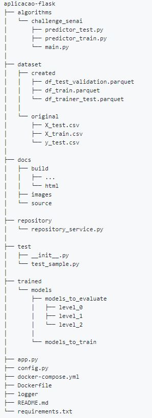

INTRODUÇÃO
==========

O Projeto MLE (Machine Learning Exam) busca realizar a solução de um desafio
proposto pelo senai em uma exame. O MLE foi implementado como uma aplicação
flask em Python e utiliza em sua comunicação API Rest via JSON.

O projeto MLE possui a seguinte estrutura geral de pastas:

Dentro da pasta `algorithms` temos os principais algoritmos desenvolvidos.

A pasta `datasets` contém alguns arquivos utilizados no treinamento e avaliação dos
modelos.

A pasta `docs` contém a documentação de todos os códigos desenvolvidos utilizando a
biblioteca Sphinx 4.0.1.

A pasta `repository` contém alguns códigos auxiliares criados para manipulação de dados.
